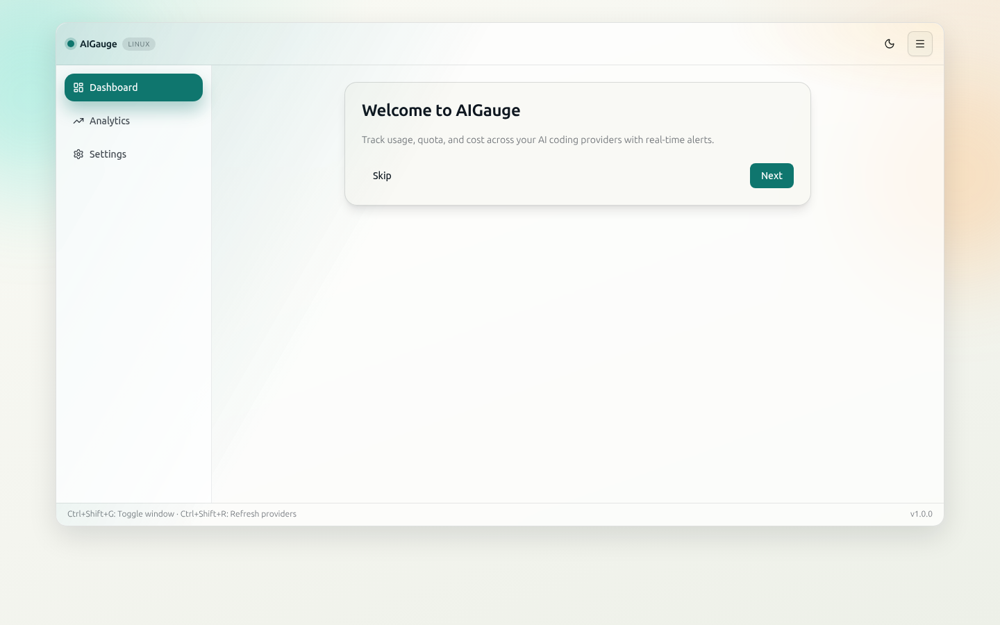
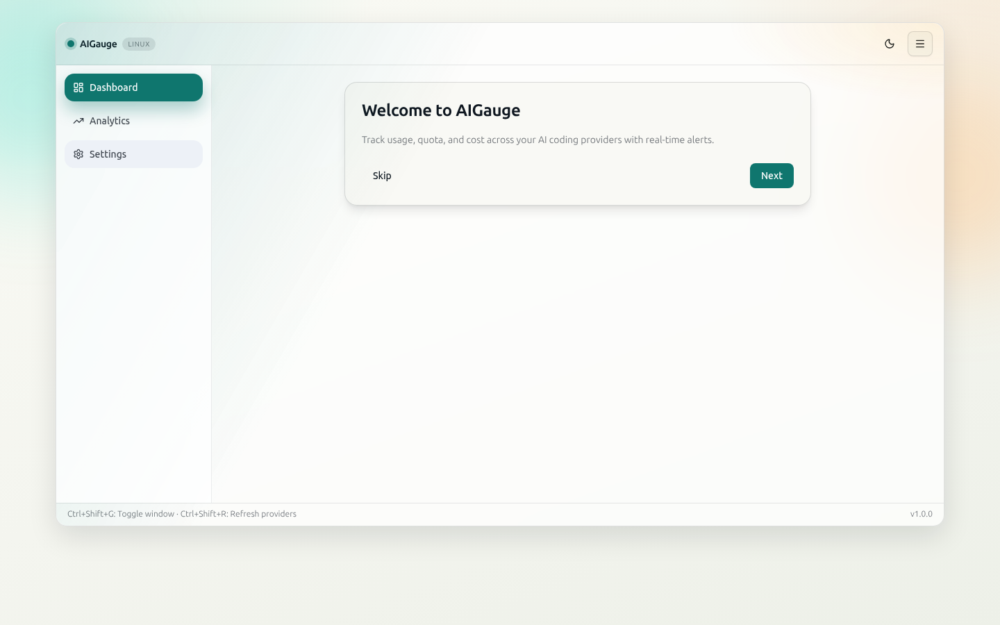
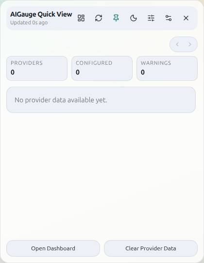
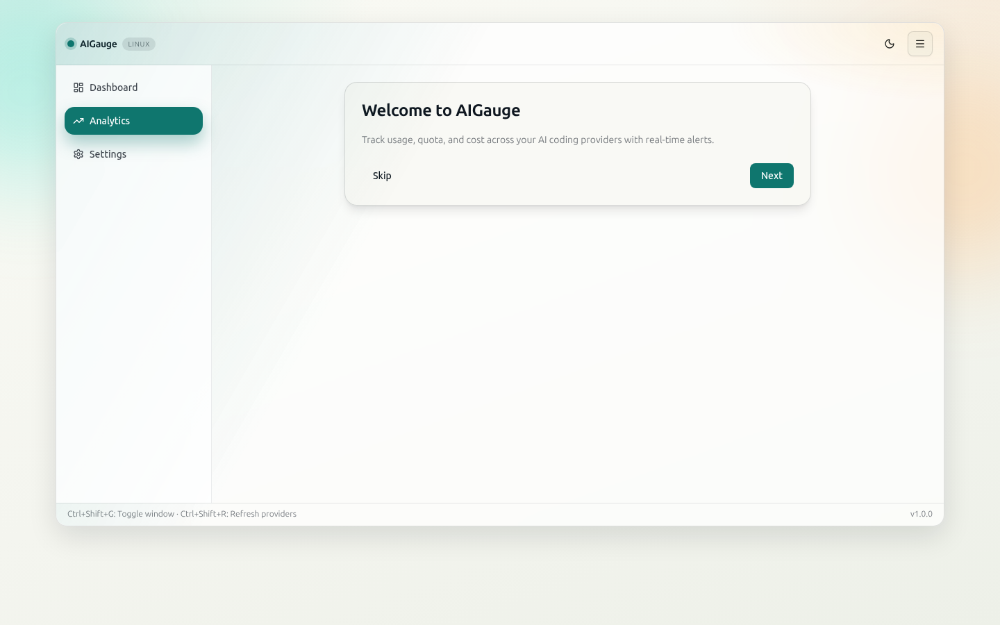

# AIGauge

> FinOps dashboard for AI coding assistants.


## Highlights

- Usage/quota/cost dashboard for major AI coding providers
- Dual-mode UI: full dashboard window + tray widget popup (`/tray`)
- Cost analytics (trend, breakdown, ROI, pace)
- System tray quick status + alerts
- Auto-update channel ready
- Export (CSV/JSON)
- Onboarding flow and accessibility polish
- Community plugin manifest foundation

## Screenshots

Main dashboard in light theme:



Main dashboard in dark theme:



Quick View tray popup:



Analytics view:



## Quick Start

1. Download release artifact for your OS.
2. Install and launch AIGauge.
3. Run onboarding and configure provider credentials.
4. Monitor usage and cost in dashboard + analytics.
5. Use tray icon click to open the compact Quick View widget.

## Provider Setup Guide (Tray Widget)

- `codex`: `~/.codex/auth.json` available from Codex CLI login.
- `claude`: `~/.claude/.credentials.json` available after Claude CLI OAuth login.
- `gemini`: `~/.gemini/oauth_creds.json` available after Gemini CLI OAuth login.
- `kiro`: `kiro-cli chat --no-interactive /usage` must work in your shell.
- `copilot`: use GitHub Device Flow in setup dialog, or provide token via `gh` auth / env.
- `cursor`: provide Cookie header manually, or rely on auto session import (compatible with CodexBar session file format, plus Firefox / Chromium plaintext cookies).
- `jetbrains`: no token required by default; AIGauge auto-detects local JetBrains AI quota file.

## Build From Source

```bash
pnpm install
pnpm doctor:providers
cargo clippy --manifest-path src-tauri/Cargo.toml --all-targets -- -D warnings
cargo test --manifest-path src-tauri/Cargo.toml
pnpm lint
pnpm build
pnpm tauri dev
```

Environment preflight checklist: [docs/ENVIRONMENT_CHECKLIST.md](docs/ENVIRONMENT_CHECKLIST.md)
Windows native smoke test: [docs/WINDOWS_NATIVE_TEST.md](docs/WINDOWS_NATIVE_TEST.md)
Test installer build guide (Windows/macOS): [docs/TEST_INSTALLER_BUILD.md](docs/TEST_INSTALLER_BUILD.md)
How to install unsigned test builds: [docs/TEST_BUILD_INSTALL.md](docs/TEST_BUILD_INSTALL.md)
Windows free self-signing (internal QA): [docs/WINDOWS_FREE_SIGNING.md](docs/WINDOWS_FREE_SIGNING.md)
Windows optional tool bootstrap: `scripts/windows-install-optional-tools.ps1`

Release gate (local):

```bash
pnpm release:check
```

Open-source preflight:

```bash
pnpm release:oss-check
```

GitHub release safe mode:

1. Push release tag (`vMAJOR.MINOR.PATCH`) from `main`.
2. Workflow creates a **Draft** release (not public yet).
3. Verify artifacts/checklist, then publish manually in GitHub Releases UI.

Release body template:

- Public release notes template: [docs/RELEASE_BODY_TEMPLATE.md](docs/RELEASE_BODY_TEMPLATE.md)

Public release trust signing:

- Windows public installers should be Authenticode-signed.
- macOS public installers should be Developer ID signed and notarized.
- Unsigned test artifacts are only for limited QA.
- Details: [docs/PUBLIC_RELEASE_SIGNING.md](docs/PUBLIC_RELEASE_SIGNING.md)

If you are sharing a test build before public signing is ready:

- Windows testers may need to click `More info` -> `Run anyway`
- macOS testers may need to right-click the app and choose `Open`
- Step-by-step tester instructions: [docs/TEST_BUILD_INSTALL.md](docs/TEST_BUILD_INSTALL.md)

## Supported Providers

Current built-in scope is intentionally fixed at **7 providers** for stability. Additional providers can be added via plugins.

| Provider | Auth Method | Tracks |
| --- | --- | --- |
| OpenAI Codex | OAuth/session token | Usage, quota, cost |
| Anthropic Claude | OAuth token | Usage, quota, cost |
| Google Gemini | OAuth token | Usage, quota, cost |
| GitHub Copilot | GitHub token / Device Flow | Usage, quota |
| Cursor | Session cookie | Usage, quota, on-demand cost |
| Kiro | Local CLI | Usage, quota |
| JetBrains AI Assistant | Local quota file | Usage, quota |
| Community Plugins | Manifest-defined | Endpoint-dependent |

## Keyboard Shortcuts

| Shortcut | Action |
| --- | --- |
| `Ctrl/Cmd+Shift+G` | Toggle main window |
| `Ctrl/Cmd+Shift+R` | Force refresh providers |

## Comparison

- **AIGauge vs CodexBar**: multi-provider + desktop analytics/tray focus.
- **AIGauge vs ccusage**: GUI, cross-provider view, onboarding, tray notifications.

## Compliance Notes

- This project is MIT-licensed and includes third-party dependencies under their own licenses.
- See [THIRD_PARTY_NOTICES.md](THIRD_PARTY_NOTICES.md) for third-party attribution and license notices.
- References to products such as CodexBar and ccusage are for factual interoperability/comparison only.
- All third-party trademarks are the property of their respective owners; no affiliation or endorsement is implied.

## Roadmap

- Phase 4: richer plugin SDK and marketplace concepts
- Evaluate additional built-in providers where product surface is distinct (for example avoid overlapping Kiro/Amazon Q semantics in the same baseline tier)
- Phase 5: team dashboards and shared budgets
- Phase 6: advanced forecast and anomaly detection

## Contributing

See [docs/CONTRIBUTING.md](docs/CONTRIBUTING.md) and [docs/PLUGIN_GUIDE.md](docs/PLUGIN_GUIDE.md).
For cross-platform execution and quality gates, see [docs/AGENT_WORKSTREAMS.md](docs/AGENT_WORKSTREAMS.md) and [docs/PLATFORM_DELIVERY_PLAYBOOK.md](docs/PLATFORM_DELIVERY_PLAYBOOK.md).
For visual baseline capture across OS targets, see [docs/PLATFORM_VISUAL_QA.md](docs/PLATFORM_VISUAL_QA.md).
For open-source publication and provenance checks, see [docs/OPEN_SOURCE_RELEASE_CHECKLIST.md](docs/OPEN_SOURCE_RELEASE_CHECKLIST.md) and [docs/PROVENANCE.md](docs/PROVENANCE.md).
For third-party licensing notices, see [THIRD_PARTY_NOTICES.md](THIRD_PARTY_NOTICES.md).

## License

MIT
