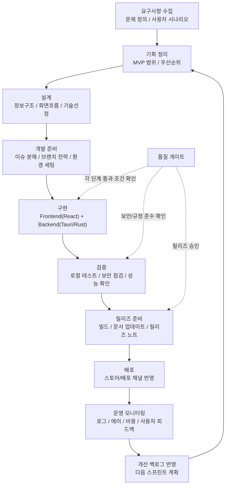

# 앱 개발 프로세스 (AIGauge)

## 단계별 산출물

| 단계 | 핵심 산출물 |
|---|---|
| 요구사항 수집 | 문제정의서, 사용자 시나리오, KPI 초안 |
| 기획 정리 | MVP 범위 문서, 우선순위 백로그, 릴리즈 목표 |
| 설계 | IA/화면흐름, 아키텍처 메모, API/데이터 모델 초안 |
| 개발 준비 | 이슈 티켓 분해, 스프린트 계획, 브랜치/커밋 규칙 |
| 구현 | 기능 코드, 단위 테스트, 변경 로그 |
| 검증 | 테스트 리포트, 보안 점검 결과, 성능 측정 결과 |
| 릴리즈 준비 | 릴리즈 노트, 마이그레이션/업데이트 가이드, QA 승인 기록 |
| 배포 | 배포 이력, 배포 태그/버전, 롤백 포인트 |
| 운영 모니터링 | 에러/성능 대시보드, 사용자 피드백 로그, 비용 리포트 |
| 개선 백로그 반영 | 개선 요구 목록, 다음 스프린트 후보, 우선순위 재정렬 결과 |

## 단계별 완료 조건 (Definition of Done)

| 단계 | 완료 조건 (DoD) |
|---|---|
| 요구사항 수집 | 문제/목표/지표가 한 문서에 합의됨 |
| 기획 정리 | MVP 범위 밖 항목이 명확히 분리됨 |
| 설계 | 핵심 플로우와 데이터 흐름 리뷰 완료 |
| 개발 준비 | 작업 단위가 담당자/일정 포함 상태로 분해됨 |
| 구현 | 핵심 기능 동작 + 치명 버그 없음 |
| 검증 | 보안/성능/회귀 검증 체크리스트 통과 |
| 릴리즈 준비 | 릴리즈 노트/롤백 시나리오 준비 완료 |
| 배포 | 실제 배포 성공 + 헬스체크 정상 |
| 운영 모니터링 | 이상 징후 대응 기준과 알림 규칙 적용 |
| 개선 백로그 반영 | 차기 스프린트에 반영 항목 확정 |

## AIGauge 책임/도구 매핑

| 영역 | 주 책임 | 주요 도구/스택 | 확인 포인트 |
|---|---|---|---|
| UI/UX 구현 | Frontend | React 19, TypeScript, shadcn/ui, Tailwind v4 | 화면 일관성, 접근성, 반응형 |
| 데스크톱 런타임 | App Core | Tauri 2.x, Rust | IPC 검증, 권한 범위, 에러 처리 |
| 데이터 수집/연동 | Provider Layer | Rust providers (Codex/Claude/Gemini 등) | API 안정성, 타임아웃, 재시도 |
| 보안/자격증명 | Security | CredentialManager(OS Keychain), CSP, Zeroize | 비밀정보 평문 금지, 감사 로그 |
| 품질 검증 | QA | cargo test/clippy, ESLint, 수동 시나리오 점검 | 회귀/성능/보안 기준 충족 |
| 릴리즈/배포 | Release | GitHub Actions, 버전 태깅, 배포 워크플로 | 빌드 성공, 서명/배포 무결성 |
